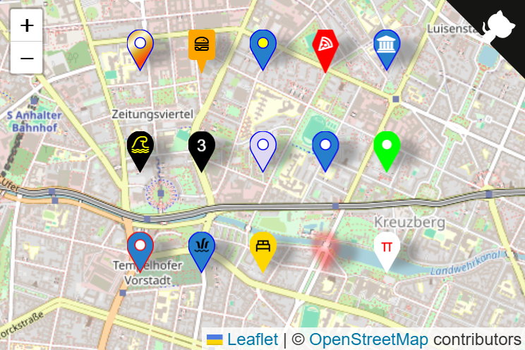

# Leaflet-SVGMarkers

Provides pure SVG markers (no more DivIcons, no unstylable dataURL's) for Leaflet v2 which you can style by CSS.  No dependencies (other than Leaflet v2).  Markers are styleable by CSS and accept a modest range of options.  Surprisingly, on my laptop they render faster than standard markers, and are about 3 times as fast on my phone.  Your milage may vary.

Basically I wanted colorable markers that would take glyphs and couldn't find
a suitable plugin for Leaflet v2, so whipped this up.  

View the [demo](https://almamigratoria-netizen.github.io/Leaflet-SVGMarkers/).   Click on individual markers to see what options were applied.



## Usage
```js
import {Map, TileLayer} from 'leaflet';
import {SVGMarker} from "./SVGMarker.js";

const OSM = 'https://{s}.tile.osm.org/{x}/{y}/{z}.png';
const map = new Map("mapdiv").setView([52.5,13.4], null, 13);
new TileLayer(`${OSM}`).addTo(map);
new SVGMarker([52.5, 13.395]).addTo(map);
// bi-bank is from BootStrap Icons.
const newMarker = new SVGMarker([52.5, 13.405], {color: 'black', glyph: 'bi-bank'});
newMarker.addTo(map);
```

## Options
* All normal [Marker options](https://leafletjs.com/reference.html#marker-icon) apply.
* `shape:`: 'square' or 'penta'.  Defaults to the vanilla map pin.
* `color:` sets the stroke and fill style attributes.
* `stroke:` sets the stroke attribute
* `fill:` sets the fill attribute 
* `dotColor:` sets the color of the dot in the marker
* `dotRadius:` sets the radius of the dot in the marker (defaults to 5)
* `style:` Embeds the passed string as a stylesheet in your SVGMarker 
icon.  You probably want to use this in conjunction with `class:`
* `glyph:` name of a glyph from a font you have loaded (like font-awesome).
* `glyphPrefix:` Defaults to the name of the glyph up to the first '-' 
* `glyphColor:` Defaults to `white`.
* `number:` Puts a number (or other character) on the marker.  The `glyphColor` option can be used to color it. 
* `class:` add a whitespace separated list of classes to the SVG element.
* `image:` SVG (string) or URL.  Adds a user supplied image to the SVG.
* `imageOpts:` attributes for the image.  Typically you should supply width and height (both default to 15).  Supply x and y to center the image (although it will try to center with the information it has).  `image`s are created using the SVG `<image>` tag, so sttributes aren't exactly the same as for `Image()`.
* Any option not understood will try to be applied to the "style" attributes, which may or may not be what you want.
> [!NOTES]
> glyphs tested with font-awesome 4.7, boxicons, bootstrap-icons 1.13.1<br/>
> adding a glyph or number automatically reduces the dot radius to zero<br/>
> Standard CSS specificity rules apply to SVG's.  Presentation attributes in SVG's have the lowest priority, element style attribes the highest.
> URL's for images can be canonical, relative (i.e., './images/foo.png'), or dataURL's.  SVG's passed as strings will be converted to a dataURL.

## The SVGMarkerUtil class
You can also import the SVGMarkerUtil class.  There are some potentially 
useful utility functions declared static so you can use them without invoking
an instance of the class.

# Installation
Either grab the package from [github](
https://github.com/almamigratoria-netizen/Leaflet-SVGMarkers) or 
`npm i @almamigratoria/leaflet-svgmarkers`

## License
Distributed under the terms of the [MIT](https://opensource.org/license/mit) license.

